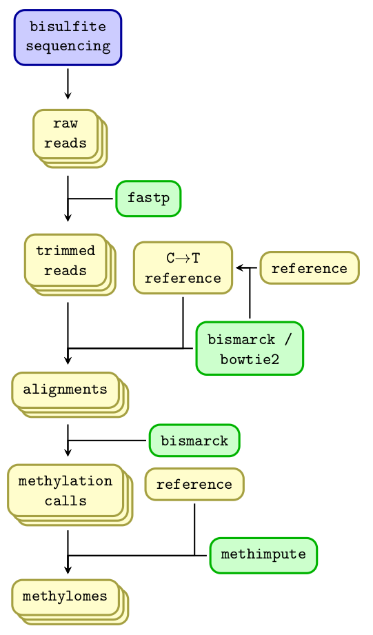

# Processing short read bisulfite sequencing data

The overall workflow for processing WGBS data is the figure below

The scripts for processing WGBS data are:
<ol>
  <li>Trimming the raw reads with fastp: read_trimming.sh, note that reads deposited to ENA have been trimmed </li>
  <li>The in silico converted reference genome with lambda phage is in folder /mreference </li>
  <li>Align reads to the in silico converted reference genome: map_bismark.sh </li>
  <li>Sort and index alignments: fix_meth_bams.sh </li>
  <li>Call methylation frequencies for each cytosine using bismack: call_methylation_bismark.sh</li>
  <li>Use methimpute to infer methylation states: </li>
</ol>
